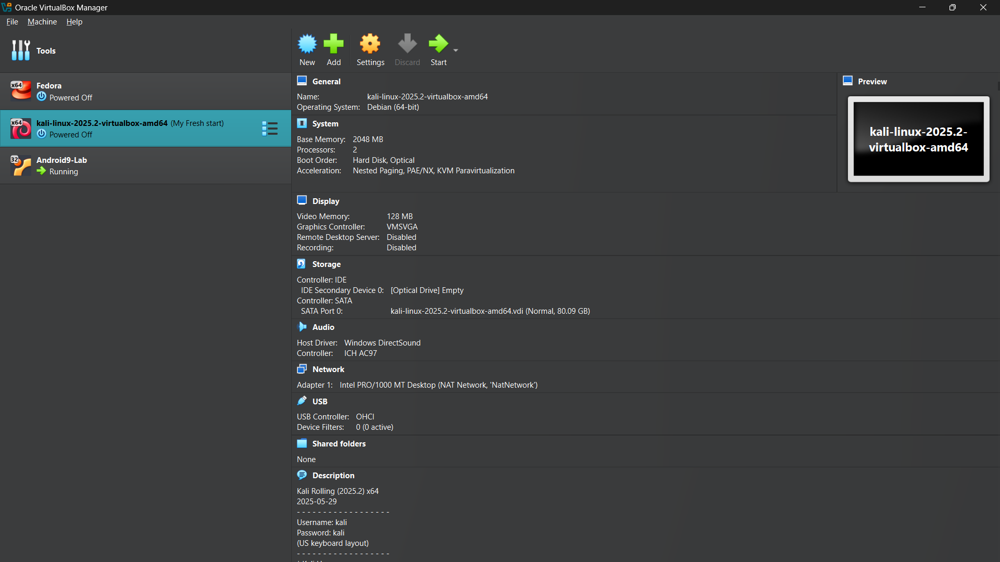
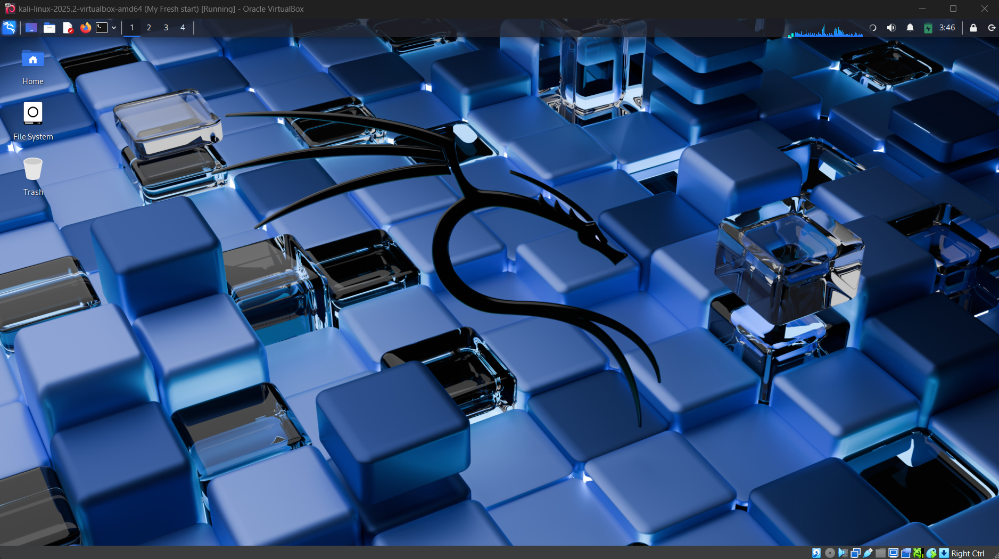
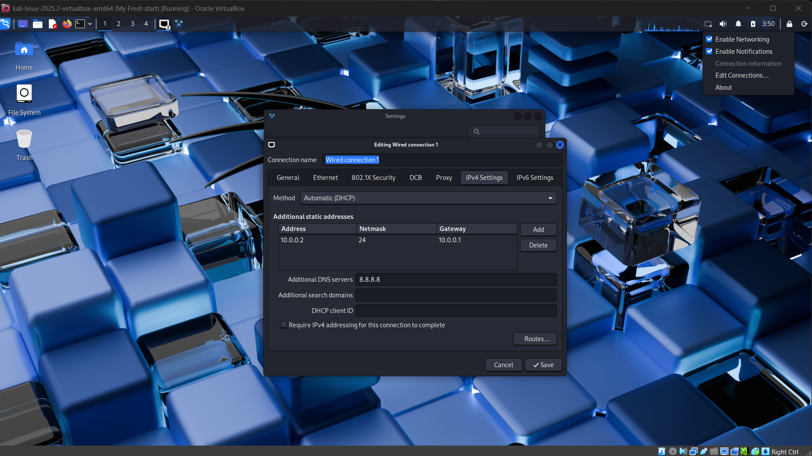

# 💻 Cybersecurity Lab Environment Setup

**Building an isolated virtual lab for penetration testing and ethical hacking practice**

 

  
  
  
  
  
  

---

## 📋 Project Overview
This repository documents the deployment of a **virtual cybersecurity and penetration-testing laboratory** utilizing VirtualBox and Kali Linux. The primary objective is to establish a secure, controlled, and isolated environment for executing cybersecurity methodologies, including network reconnaissance, vulnerability assessments, and authorized exploit testing. The infrastructure is routed through a private virtual network, enabling the seamless integration of additional target machines for advanced future scenarios.

---

## 🚀 Objectives
* **Hypervisor Deployment:** Install and configure VirtualBox.
* **Environment Provisioning:** Import and provision Kali Linux as the primary attack virtual machine.
* **Network Isolation:** Architect a private **NAT Network** to segment lab traffic.
* **Static Addressing:** Assign and verify a consistent IPv4 address for the Kali VM.
* **Connectivity Validation:** Ensure outbound internet access and internal DNS resolution.
* **State Management:** Capture a clean baseline VM snapshot for rapid recovery.
* **Comprehensive Documentation:** Detail the architectural setup for reproducible deployments.

---

## 🔬 Purpose of the Lab
This isolated infrastructure is designed for practical, hands-on cybersecurity skill development. It supports specialized operational tasks, including:
* Network reconnaissance and topography mapping
* Port scanning and service enumeration
* Vulnerability identification and assessment
* Deep packet inspection and traffic analysis
* Web application security testing
* Exploit development and execution

> ⚠️ **Disclaimer:** This laboratory environment is strictly for educational purposes. All tools and techniques must only be applied to systems you explicitly own or have documented authorization to test. 

---

## 🌐 Lab Architecture

*Note: The architecture is designed for scalability, allowing vulnerable target machines to be introduced to the `10.0.0.0/24` subnet in subsequent iterations.*

---

## 🎛️ System Configuration

| 📦 Component | 📝 Specification |
| :--- | :--- |
| **Host Operating System** | Windows 10 |
| **Host Memory (RAM)** | 8 GB |
| **Processor** | Intel Core i7 |
| **Hypervisor** | VirtualBox 7.2 |
| **Security OS** | Kali Linux 2026.2 |
| **Allocated VM RAM** | 2048 MB |
| **Virtual Network Mode** | NAT Network |
| **Subnet Allocation** | 10.0.0.0/24 |
| **Kali Static IP** | 10.0.0.2/24 |
| **Default Gateway** | 10.0.0.1 |
| **DNS Resolution** | 8.8.8.8 |
| **Target VM DHCP Pool** | 10.0.0.3 – 10.0.0.99 |

---

## 🛠️ Deployment Procedure

### Phase 1: Prerequisite Installation
Installed 7-Zip to extract the compressed Kali Linux virtual machine appliance (`.7z` format).

### Phase 2: Hypervisor Setup
Installed Oracle VM VirtualBox to serve as the foundational hypervisor managing all virtualized assets.

### Phase 3: Virtual Network Architecture
Configured a dedicated NAT Network within VirtualBox to ensure VMs can route traffic to the internet while maintaining a segmented internal LAN for cross-VM communication.
* **Network Name:** NatNetwork
* **IPv4 Prefix:** 10.0.0.0/24
* **DHCP:** Enabled (for future targets)
* **IPv6:** Disabled

### Phase 4: OS Import & Provisioning
Imported the official Kali Linux VirtualBox image. Allocated **2048 MB of RAM** and bound the network interface to the newly created NAT Network:
* **Attached to:** NAT Network
* **Network Name:** NatNetwork
* **Adapter Type:** Intel PRO/1000 MT Desktop

*A shared host-to-guest folder was mapped to facilitate secure file transfers.*

### Phase 5: Network Interface Configuration
Configured a static IP assignment within the Kali Linux network manager to ensure operational consistency across lab sessions:
* **IP Address:** 10.0.0.2
* **Subnet Mask:** 255.255.255.0
* **Gateway:** 10.0.0.1
* **DNS:** 8.8.8.8

### Phase 6: Baseline Snapshot Creation
Generated a VirtualBox snapshot titled `Clean Kali - Network Setup`. This establishes a pristine operational baseline, allowing instantaneous rollback if the OS state becomes corrupted during testing.

---

## 📡 Connectivity & Tool Verification

| 🧪 Validation Test | ⌨️ Executed Command | 🏁 Expected Outcome |
| :--- | :--- | :--- |
| **Interface Addressing** | `ip a` | `10.0.0.2/24` successfully bound to `eth0` |
| **Gateway Routing** | `ping -c 4 10.0.0.1` | 0% Packet Loss |
| **External Routing** | `ping -c 4 8.8.8.8` | 0% Packet Loss |
| **DNS Resolution** | `nslookup networkwalks.com` | Standard query returns valid A records |
| **Core Tooling (Nmap)** | `nmap --version` | Nmap successfully initialized |

---

## 🔧 Troubleshooting & Resolutions

### Issue 1: Outbound Routing Failure After Static IP Assignment
After defining the static IPv4 configuration, Kali occasionally dropped external internet connectivity.
**Resolution:** Forced the NetworkManager to bypass Duplicate Address Detection (DAD) timeouts by executing `sudo nmcli connection modify "Wired connection 1" ipv4.dad-timeout 0`, followed by a service restart. 

### Issue 2: Hypervisor VT-x Execution Error
The virtual machine aborted the boot sequence, citing disabled hardware virtualization.
**Resolution:** Halted the host machine, accessed the UEFI/BIOS firmware settings, and enabled **Intel VT-x**. Saved the configuration, rebooted the host, and successfully powered on the VM.

---

## 🧠 Key Learnings

* **Network Segmentation:** Gained practical understanding of how a NAT Network differs from standard NAT, specifically its ability to facilitate internal VM-to-VM traffic required for localized attack simulations.
* **Linux Networking:** Developed proficiency in manually configuring and verifying IPv4 routing tables, static assignments, and DNS resolvers within a Debian-based environment.
* **State Preservation:** Recognized the critical importance of hypervisor snapshots for maintaining a reliable, immutable baseline before executing high-risk commands or installing unstable exploit frameworks.
* **Technical Documentation:** Improved ability to formally document architectural configurations, network typologies, and systematic troubleshooting steps for professional handoff.

---

## 📥 Resources & Dependencies
* **Archive Utility:** [7-Zip](https://7-zip.org/download.html)
* **Hypervisor:** [Oracle VM VirtualBox](https://virtualbox.org/wiki/Downloads)
* **Offensive OS:** [Kali Linux](https://kali.org/get-kali)

---

## ✍️ Author
**OSIM KUMAR LAHA**  
*Cybersecurity novice*  
LinkedIn: https://www.linkedin.com/in/osimlaha/

> **Program:** Cybersecurity at Networkwalks | **Module:** Week 01 | **Track:** Lab Infrastructure Setup
